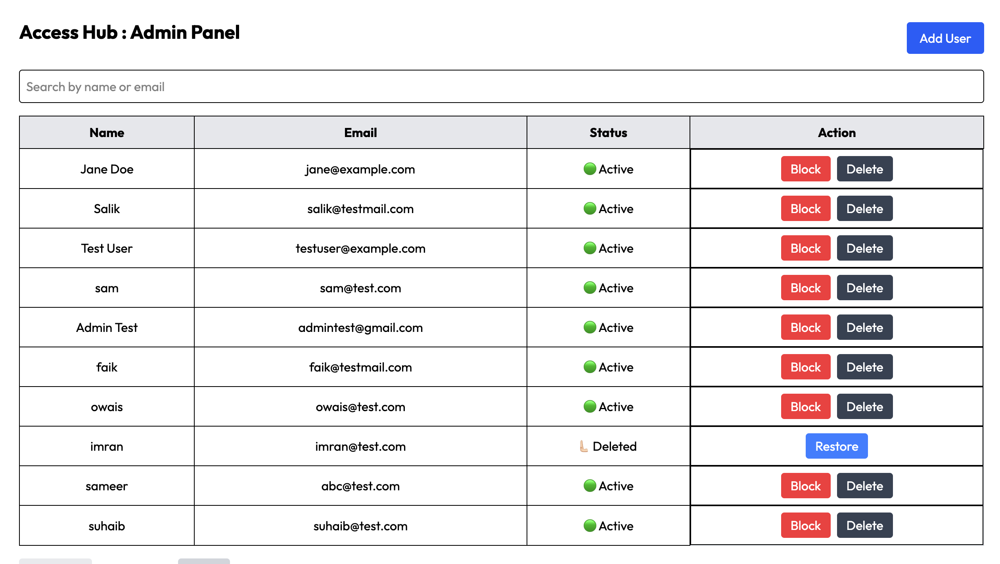

<p align="center">
  
</p>

# Access Hub - Authentication System & Admin System

**Access Hub** is a full‑stack authentication and user‑management system built with**React (Vite) on the frontend and Node.js + Express on the backend**. The project is designed to mirror real‑world authentication and admin workflows, with a strong focus on clean architecture, scalable logic, and portfolio‑ready engineering practices.

This repository intentionally balances **production‑style patterns** with learning‑oriented transparency, making it ideal for interviews, demos, and further extension.

---

## Live Demo

- **Frontend (Vercel):** https://access-hub-five.vercel.app
- **Backend (Render):** https://access-hub-yc3e.onrender.com

## System Architecture:

┌────────────────────┐
│ Browser │
│ (React Client) │
│ │
│ - Login / Signup │
│ - Protected Routes│
│ - Admin Panel │
│ - Debounced Search│
│ - Infinite Scroll │
└─────────┬──────────┘
│ HTTP (Axios)
│ JWT in Headers
▼
┌────────────────────┐
│ Express Server │
│ (Node.js / API) │
│ │
│ Auth Routes │
│ - /auth/login │
│ - /auth/signup │
│ │
│ Admin Routes │
│ - /admin/users │
│ - /admin/block │
│ - /admin/delete │
│ - /admin/restore │
│ │
│ Middleware │
│ - JWT Verify │
│ - Status Checks │
└─────────┬──────────┘
│
│ Mongoose ODM
▼
┌────────────────────┐
│ MongoDB │
│ (Atlas Cloud) │
│ │
│ Users Collection │
│ - active │
│ - blocked │
│ - deleted (soft) │
└────────────────────┘

---

## Core Features

- User **Signup & Login**
- **JWT-based authentication**
- **Protected routes** using React Router
- Automatic **redirection after login**
- Users are redirected back to the page they originally tried to access
- Secure **logout**
- Clean UI styled with **Tailwind CSS**
- Notifications using **React Toastify**
- API communication via **Axios**
- Admin panel for user management
- Search users by name or email
- Intersection observer
- Lazy Loading & Infinite Scroll (Frontend)
- Skeleton Loader & Infinite Scroll
- Secure logout with token cleanup

---

## Admin Panel

⚠️ Important: The /admin route is intentionally not protected in this project.
In a real‑world system, this would be secured via role‑based access control (RBAC).

- View all registered users
- Create new users (with controlled UI state)
- Block / Unblock users
- Soft‑delete users
- Restore deleted users
- View user status:
  🟢 Active
  ⛔ Blocked
  🗑 Deleted

- Admin Logic Highlights
- Full CRUD operations on users
- Debounced search (name or email)
- Client‑side pagination
- API‑driven state updates (no full reloads)

<p align="center">
  
</p>

## 🚫 Blocked User Behavior

- When a user is blocked:
- ❌ Login is disabled
- ❌ Re‑registration using the same email is blocked
- User status is persisted in the database
- Status is validated during authentication

## Feature: Skeleton Loader + Infinite Scroll (No Libraries)

Access Hub now includes a smooth, modern **infinite scroll** experience for the avatar grid along with a **skeleton loader** (built without any external UI libraries).

### What it does

- Loads users in **batches of 10** (`LOAD_COUNT = 10`)
- Uses **IntersectionObserver** to detect when you reach the bottom
- Simulates an API call with a short delay to mimic real network behavior
- Shows **skeleton placeholders** while the next batch is being fetched
- Appends new users to the existing list (no page refresh)

### How it works (High Level)

1. The Dashboard starts with an empty `users` array.
2. `fetchUsers()` generates the next 10 users using the current `users.length` as a cursor.
3. While fetching, `isLoading` becomes `true`, and the UI renders `LOAD_COUNT` skeleton cards.
4. When data arrives, skeletons disappear and new avatars are appended.
5. IntersectionObserver triggers the next fetch automatically as you scroll.

### Key Implementation Notes

- **No preloaded dataset** (no `TOTAL_USERS` / no `MAX_USERS`)
- A **loading lock** prevents duplicate fetches:
  - The fetch function exits early if `isLoading === true`
- Skeleton loader uses simple Tailwind + `animate-pulse`:
  - No external UI dependencies

### UX Result

Users see a responsive avatar grid that keeps loading more content as they scroll, with clean skeleton placeholders during fetch time — similar to real-world apps like Instagram/LinkedIn feeds.

## 🧭 Authentication Flow

1. User signs up → data stored securely in MongoDB
2. User logs in → JWT token generated
3. Token stored on client
4. Protected routes validate token
5. User redirected to intended route after login
6. admin can search the user by email or name

This behavior closely mirrors real-world authentication systems used in production apps.

⚠️ Note:
The /admin route is currently not protected.
It is assumed that only authorized administrators will access this panel.
(This is a deliberate design choice for learning and demonstration.)

---

## 🛠 Tech Stack

### Frontend

- React (Vite)
- React Router DOM
- Axios
- Tailwind CSS
- React Toastify

### Backend

- Node.js
- Express.js
- MongoDB (Atlas)
- Mongoose
- JWT (JSON Web Tokens)
- bcrypt.js
- CORS

---

### Deployment

- **Frontend:** Vercel
- **Backend:** Render
- **Database:** MongoDB Atlas

---

## Future Enhancements

The following features are planned to make **Access Hub** production-ready:

### 🔐 Authentication & Security

- Email verification (OTP)
- Password reset flow
- Refresh tokens
- Token expiry handling
- Role‑based access control

### ⚙️ Backend Improvements

- Centralized error handling
- Rate limiting for auth APIs
- Input validation using Joi / Zod
- API versioning
- Secure cookie-based auth option

### 🧑‍💻 User Experience

- Edit profile functionality
- Session persistence
- Account settings page
- Dark mode support

---

## Why This Project?

Access Hub was built to:

- Understand **real-world authentication patterns**
- Practice **secure frontend-backend integration**
- Demonstrate production-style routing logic
- Create a **resume-ready project** showcasing best practices

---

## 🛠️ Setup Instructions (Local Setup)

```bash
# Clone repository
git clone https://github.com/SALIK-JAVID/Access-Hub.git
cd Access-Hub


# Backend
cd server
npm install
npm start


# Frontend
cd ../client
npm install
npm run dev
```

## 📄 License

This project is open-source and available under the **MIT License**.

---

## Contributions

Contributions, issues, and feature requests are welcome.  
Feel free to fork the repository and submit a pull request.

---

### ⭐ If you like this project, consider giving it a star!
